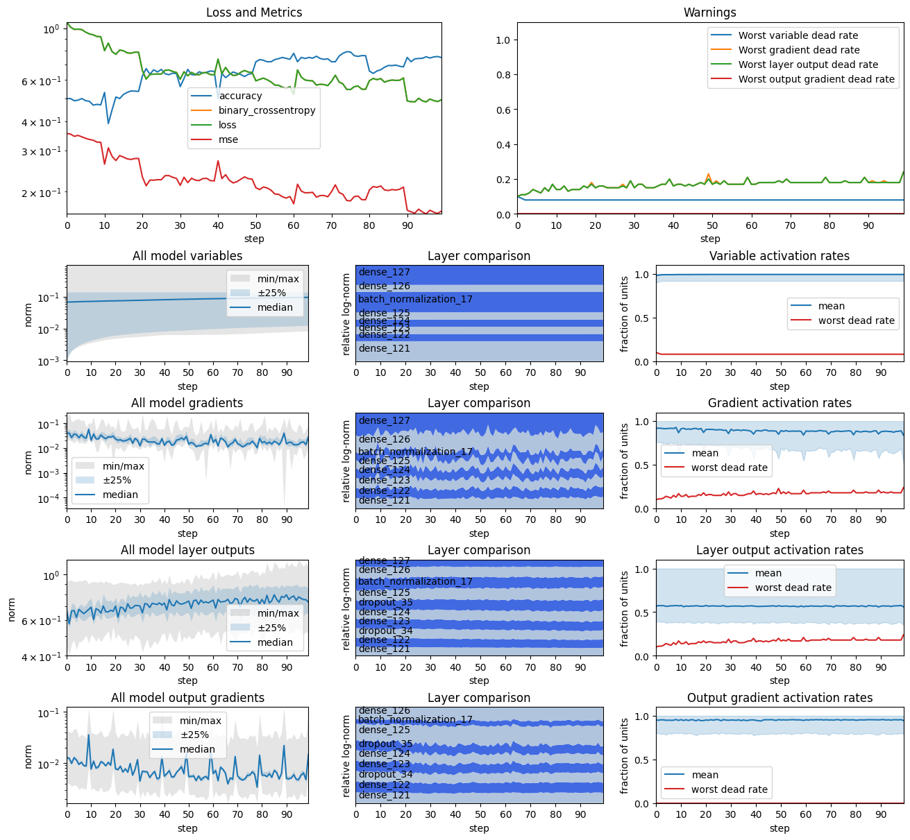

# Training Instrumentation Toolkit
TensorFlow addons for instrumenting training loops in order to collect and analyse detailed metrics on gradients,
weights, and layer activations. Improves development turnaround time by granting access to more subtle indicators of problems than mere loss curves.
Aids in troubleshooting by providing insight into many aspects of model training in one go, quickly highlighting if any of the many common issues are occurring.

Example visualisation of metrics gathered during training:



## Docs

See `doc` folder for Jupiter notebooks with explanation of functionality.

## Releases

Not currently published as on official python package.

The following code can be used to import the package into a Jupiter notebook:

```python
import os
import sys
if not os.path.isdir('training-instrumentation-toolkit'):
  !git clone https://github.com/malcolmlett/training-instrumentation-toolkit.git
sys.path.append('training-instrumentation-toolkit')
import training_instrumentation as tinstr
import training_explainer as texpl
```


