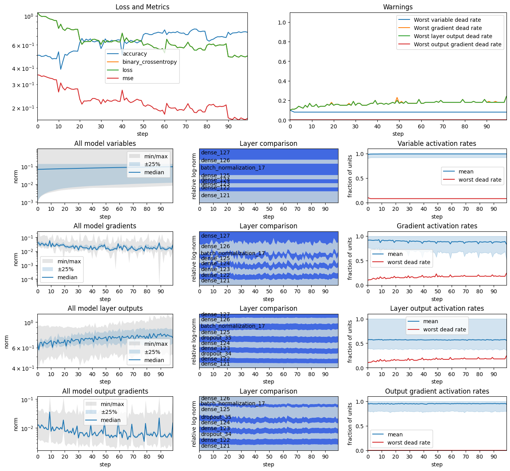

# Training Instrumentation Toolkit
TensorFlow addons for instrumenting training loops in order to collect, analyse, and visualize detailed metrics on
gradients, weights, and layer activations.

Intended to improve development turnaround time by making it easier to access subtle indicators of training progress and
potential training problems. Aids in troubleshooting by providing insight into many aspects of model training in one go,
quickly highlighting if any of several common issues are occurring.

Example visualisation of metrics gathered during training:



Some of the kinds of problems that this tooling is targeted at include:
* vanishing and exploding gradients
* oscillating gradients
* neuron death
* and more generally for identifying the cause of slow training progress

This project came out of experiments looking into options for improving the "training observability" - ie: improving our
ability to observe how the model training algorithm is behaving. I'm not seeking to replace existing tooling,
rather to suggest some data collection and visualisation approaches that I think would be good to add to existing
tooling for TensorFlow and PyTorch. I have intentionally focused on basic plotting via matplotlib so that I could
get away from any limitations inherent within the existing plotting tools such as that provided by TensorBoard,
Weights & Biases, etc.

Anyone is free to take what's here and use as a basis for their own work, though attribution would be greatly
appreciated.

## Importing

The following code can be used to import the package into a Jupiter notebook:

```python
import os
import sys
if not os.path.isdir('training-instrumentation-toolkit'):
  !git clone https://github.com/malcolmlett/training-instrumentation-toolkit.git
sys.path.append('training-instrumentation-toolkit')
import training_instrumentation as tinstr
import training_explainer as texpl
```

The toolkit is not currently published as a python package.

## Quickstart

The following runs a model training while capturing the metrics needed to generate the image above.

```python
import tensorflow as tf
import training_instrumentation as tinstr

def my_model():
    ....
    
def my_dataset():
    ...

variables = tinstr.VariableHistoryCallback(per_step=True)
gradients = tinstr.GradientHistoryCallback(per_step=True)
outputs = tinstr.LayerOutputHistoryCallback(per_step=True)
output_gradients = tinstr.LayerOutputGradientHistoryCallback(per_step=True)

model = my_model()
model.compile(optimizer='adam', loss='binary_crossentropy', metrics=['accuracy', 'mse', 'binary_crossentropy'])
dataset = my_dataset()
history = tinstr.fit(model, dataset.batch(32), epochs=10, callbacks=[
    variables, gradients, outputs, output_gradients, tinstr.HistoryStats(per_step=True)])

tinstr.plot_history_overview([history, variables, gradients, outputs, output_gradients])
```

## Docs

See the [doc](doc/index.md) folder for Jupiter notebooks that explain the functionality.

Blog posts using this work are currently being written.
